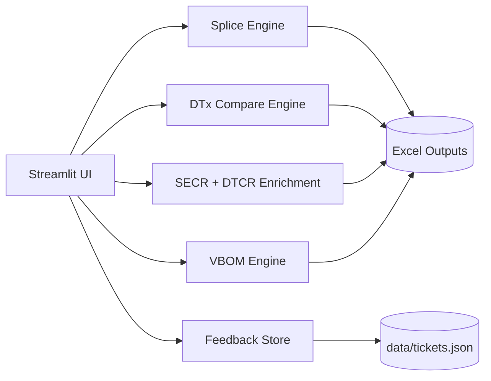

# Automotive Wiring Automation

Automotive Wiring Automation is a Streamlit application that consolidates multiple wiring-engineering workflows into one repeatable, testable toolchain.

It currently supports:
- Splice generation from harness complexity + option logic.
- DTx old-vs-new comparison with change reporting.
- DTCR matching and SECR enrichment.
- VBOM risk-matrix workflow orchestration.
- In-app structured feedback ticketing.

## Business Problem

Wiring engineering teams often run a fragmented process:
- Spreadsheets are manually transformed and reconciled.
- DTx / DTCR / SECR traceability is spread across separate tools.
- Hand-built formulas and copy/paste steps are error-prone.
- Turnaround time increases when part counts and harness variants grow.

This project addresses those pain points by standardizing data loading, rule evaluation, and workbook output generation in one application.

## Measurable Impact

You can track impact with these operational metrics:
- Cycle time reduction: compare hours per release before/after adoption.
- Defect reduction: count escaped spreadsheet logic defects per sprint.
- Rework reduction: count manual touchpoints removed per workflow.
- Throughput increase: number of harness/DTx comparisons processed per day.

Suggested KPI baseline formula:

$$
\text{Time Savings \%} = \frac{\text{Baseline Hours} - \text{Automated Hours}}{\text{Baseline Hours}} \times 100
$$

## Architecture

High-level architecture is documented in [docs/ARCHITECTURE.md](docs/ARCHITECTURE.md).



## Quick Start

1. Create a Python environment.
2. Install dependencies.
3. Launch Streamlit.

```bash
python3 -m venv .venv
source .venv/bin/activate
pip install -r requirements.txt
python -m streamlit run app.py
```

For shell launch script:

```bash
chmod +x run_app.sh
./run_app.sh
```

## Tests

Run unit tests locally:

```bash
pytest -q
```

GitHub Actions runs the same suite on every push and pull request.

## Anonymized Sample Data

Sample, non-confidential fixtures are available in [samples/anonymized](samples/anonymized):
- feedback_tickets_sample.json
- dtcr_matching_sample.csv
- dtx_compare_summary_sample.csv

## Demonstration

A short text demonstration is available at [docs/DEMO.md](docs/DEMO.md).

## Commit Message Quality

Avoid non-descriptive commit messages like "push" or "fix".

Use structured messages with intent + scope, for example:
- feat(dtx): add connector change summary worksheet
- fix(secr): guard empty DTCR upload in enrichment flow
- docs(readme): add architecture diagram and KPI guidance
- test(ci): skip fixture-dependent test when sample files are absent

Full guidance: [docs/COMMIT_MESSAGE_GUIDE.md](docs/COMMIT_MESSAGE_GUIDE.md)

## Naming Recommendation

Recommended repository name for external sharing:
- automotive-wiring-automation

If you choose to rename on GitHub, this README and project title already align with that naming.

## Confidentiality Notes

This repository has been updated to avoid hard-coded local machine paths and to include anonymized sample data for public-safe demos. Review third-party inputs before publishing to ensure no proprietary workbook content is included.
