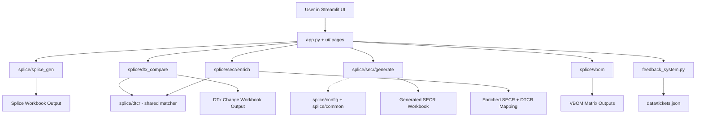

# Architecture

## Overview

The application is a Streamlit front-end that orchestrates domain engines for wiring workflows. Each engine is responsible for one bounded business process and returns deterministic outputs (primarily Excel artifacts).

Each functional area is its own package under `splice/`, with a Streamlit-free
public interface re-exported from the package `__init__`. Shared helpers live in
`splice/common` (text/Excel/validation) and `splice/dtcr` (the single canonical
DTCR matcher); environment-specific paths and tokens live in `splice/config`.
The Streamlit layer (`app.py`, `ui/`) only renders — it imports from `splice.*`
and never the reverse.

## Key Design Principles

- Single-responsibility packages: each area under `splice/` maps to one workflow.
- File-in / file-out processing: engines take bytes/paths and return bytes/DataFrames.
- Streamlit-independent core: `splice/*` never imports `streamlit`, so any area can be driven from a script or agent.
- Defensive parsing: validate required columns early, raise actionable errors.
- Repeatable outputs: deterministic workbook generation.

## Runtime Data Flow

1. User uploads workbook(s) in Streamlit.
2. app.py dispatches to the selected engine.
3. Engine validates schema and processes transformations.
4. Engine emits output bytes + metadata.
5. UI presents downloads and summary tables.
