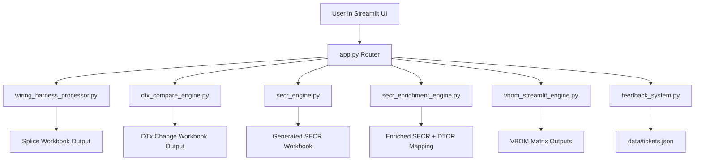

# Architecture

## Overview

The application is a Streamlit front-end that orchestrates domain engines for wiring workflows. Each engine is responsible for one bounded business process and returns deterministic outputs (primarily Excel artifacts).

## Key Design Principles

- Single-responsibility engines: each module maps to one workflow.
- File-in / file-out processing: workflows are easy to test.
- Defensive parsing: validate required columns early.
- Repeatable outputs: deterministic workbook generation.
- CI guardrails: unit tests run on pull requests and pushes.

## Runtime Data Flow

1. User uploads workbook(s) in Streamlit.
2. app.py dispatches to the selected engine.
3. Engine validates schema and processes transformations.
4. Engine emits output bytes + metadata.
5. UI presents downloads and summary tables.
